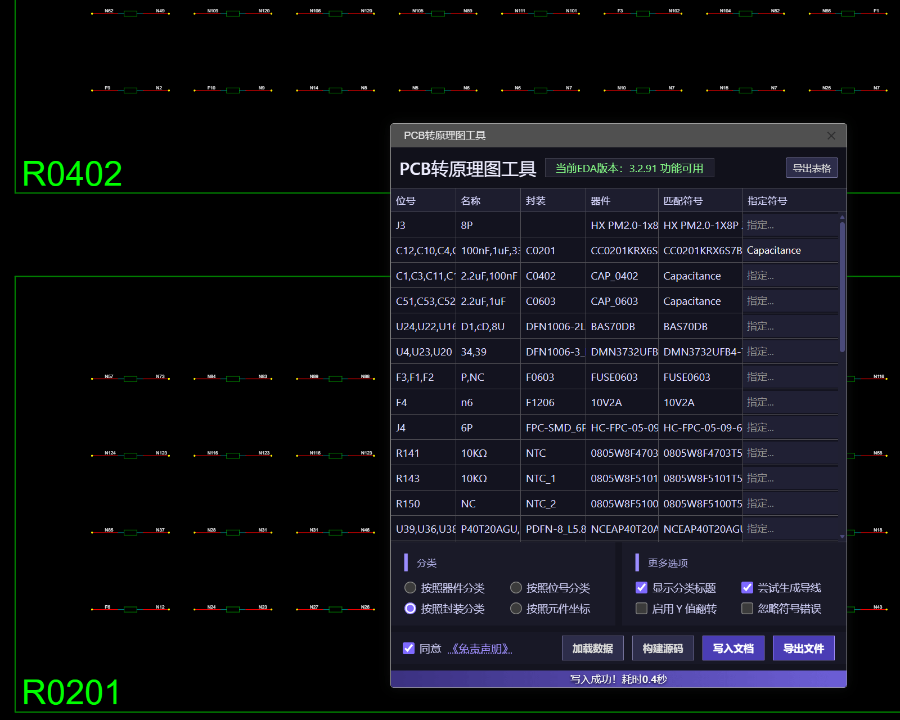

# 功能如插件标题所示
### 这是一个PCB转原理图工具，支持千量级元件数量，支持多部件元件，可生成对应引脚导线，生成源码速度极快
## 支持嘉立创EDA V2.2.x 和 V3.x 版本

# 使用方法
## [演示视频](https://jlc-prod-pbt-pub.oss-cn-shenzhen.aliyuncs.com/pbt/bbs/8722946808120012800-20260319_201106.mp4)

### 打开对应板子的原理图，打开插件 ⇒ 同意《免责声明》 ⇒ 加载数据 ⇒ 构建源码 ⇒ 写入文档 / 导出文件(V2.2格式)

### 完成写入并确认无误后，使用 "从PCB导入变更" 功能同步参数，可全选元件在右侧属性栏显示位号和名称

**实测当写入的数据量过大时，可能会出现白屏的情况，可以重试或者导出工程文件后手动导入**

## [符号异常处理方法](https://jlc-prod-pbt-pub.oss-cn-shenzhen.aliyuncs.com/pbt/bbs/8722946948186492928-20260319_201709.mp4)

# 指定符号
### 在指定符号输入框粘贴对应符号的名称即可（必须是当前列表里的符号）

# 注意事项

## 在V3版本覆写文档时，需要手动清空画布再写入
### 在V3版本中，源码的Y值是翻转的，如有需要，可以勾选【启用Y值翻转】

> 进阶说明：本工具主要依赖工程文件（.epro）解析，理论上只要提供正确的工程文件，稍作修改代码即可在不打开EDA软件的情况下进行PCB转原理图。欢迎有经验的用户自行探索。

## 许可证
本扩展采用 Apache License 2.0 许可证。